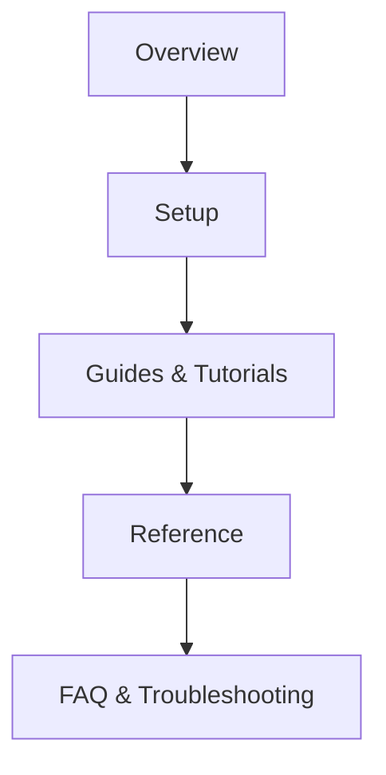

# My View of Ideal Good Documentation

I believe that technical documentation is an essential part of any product. Even when a product has an intuitive interface, there always comes a moment when the user thinks: *“Okay, where’s the manual?”*.

Ideal technical documentation should enhance the overall user experience by helping people understand how to use the product and guiding them through confusing or complex situations. Documentation must be clear, structured, and concise - only the information that truly matters. Wherever possible, it should be supported by visuals such as screenshots, diagrams, or tables, and key points should stand out through typography or color-coded callouts.  

In my work, I’ve often studied documentation from companies like **[Microsoft](https://learn.microsoft.com/en-us/docs/)**, **Apple**, **GitHub**, and **[Notion](https://www.notion.com/)**. I wanted to see how large, mature organizations approach structure and clarity, and to adopt their best practices to improve the quality of my own documentation.

## Structure

An ideal documentation should follow a clear and consistent structure:
1. **Overview** – purpose, audience, and core concepts  
2. **Setup** – installation and configuration
3. **Guides & Tutorials** – practical, scenario-based learning  
4. **Reference** – APIs, commands or parameters
5. **FAQ & Troubleshooting** – real-world solutions to common problems  

Logical navigation and consistent naming allow users to find answers fast.

## Style & Tone

I believe that writing should be **concise** and use the **active voice**. Each sentence should clearly convey the writer's intent, context, or action. It's important to use consistent terminology, a second-person ("you") perspective, and short sentences to reduce cognitive load. The tone should be professional and approachable, with a focus on the developer experience, rather than marketing.

## Content Quality

Every detail must be **accurate, version-aware, and testable**.
Broken examples or outdated references quickly erode trust, so documentation must evolve alongside the product.

## Visuals & Formatting

It is necessary to use **code blocks, tables, UI screenshots, and diagrams** to illustrate complex flows. Callouts and highlights to emphasize critical steps:

- ⚙️ **Note:** Optional configurations or advanced tips  
- ⚠️ **Warning:** Potential issues or limitations  
- ✅ **Example:** Real, working use cases

## Tooling & Maintenance

Maintain docs as code:  
- **Markdown** for portability and Git-based workflows  
- **CI checks** for broken links and formatting  

---
